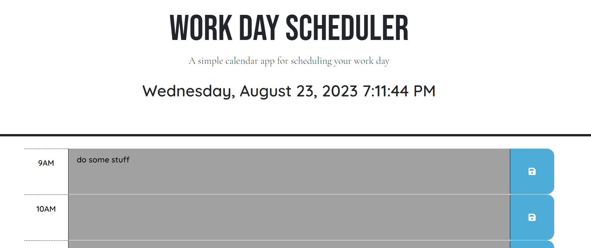

# Daily Planner

## Description

This daily planner is a pretty simple day planner where you can add reminders/meetings/chores to your daily 9-5 work day. It does not include hours before 9am or after 5pm. The current hour will display in blue, past hours display in gray, and future hours display in green.

## Visuals

Here is a screenshot of the completed project 

## Usage

This app is very straight-forward to use. You simply click a field in which you want to add a reminder, click the blue save icon, and the file saves to local storage. When you refresh the page, your saved reminder will remain on the viewport.

## Support

You can reach me on [Twitter](https://twitter.com/__dsatpm) with any questions or comments.

## Contributing

This was created by Jeremiah Haynes, although some research was done using Google, Stack Overflow, and ChatGPT.

## Project Status

This project is basically complete. I may come back at a later time and make the planner more robust, adding additional days, weeks, hours, etc.